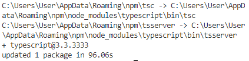
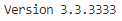

# Praktikum 2
## 1 | Typescript

### Bagian 1 : Instalasi Typescript
- ketik perintah yang ada dibawah ini 
```
npm install -g typescript
```
- maka hasilnya seperti ini

    

- cek versi dari typescript yang sudah terinstall
```
tsc --version
```
- hasilnya yakni seperti dibawah ini

    

- membuat direktori dan membuat file didalam direktori tersebut
```
mkdir ts-hello
cd ts-hello
```
- berilah nama file tersebut main.ts pada direktori ts-hello dan tulis code dibawah ini
```
function log(message){
    console.log(message);
}
let message = 'Hello User!';
log(message);
```

- buka terminal untuk mengonversi file typescript ke javascript
```
tsc main.ts
```
- hasilnya seperti ini

    

- dan jika dilakukan perintah
```
ls -a
```

- maka hasilnya terdapat 2 file

    

### Bagian 2 : Declaring Variables
- seperti gambar dibawah ini

    

- mendeklarasikan do something untuk menghasilkan yang ada di 
```console.log```

### Bagian 3 : Types
- tipe data, dimana banyak sekali tipe data pada angular dan hampir sama dengan yang lainnya. yang membedakan yakni dimana code ```let``` disini sebagai all character

     

### Bagian 4 : Type Assertion
- dimana type assertion ini sebagai deklarasi dari tipedata yang pada bagian sebelumnya

     

### Bagian 5 : Arrow Function
- dimana kita dapat mendeklarasikan isi function dengan sebuah arah seperti ```=>```

     

