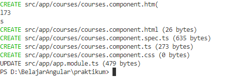
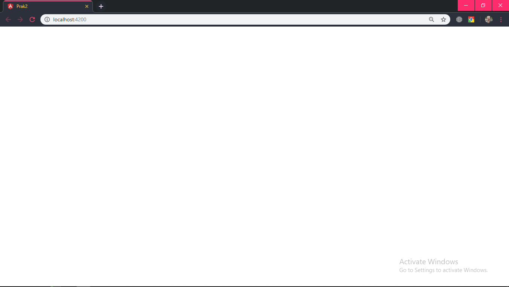
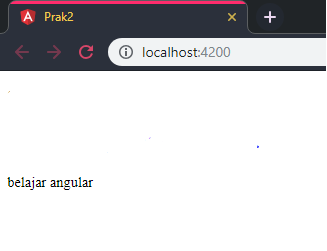
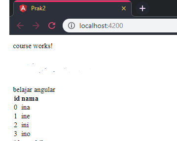
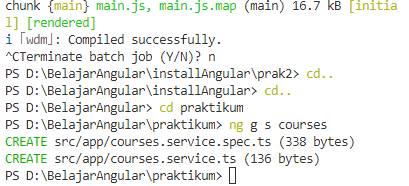
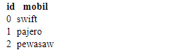

# Praktikum 3
## 2 | Angular Fundamental

### Bagian 1 : Component Basic
- ketik perintah yang ada dibawah ini 
```
ng g c name
```
hasil nya akan seperti ini

    

- Buka file app.modules.ts dan hapus bagian course component
```
//CourseComponent
```
- hasilnya yakni seperti dibawah ini

    

### Bagian 2 : Templates
- buka file courses.component.ts dan tambahkan code dibawah ini :
```
title = "belajar angular";
```

- hasilnya seperti dibawah

    

- tambahkan string pada binding data

```
    <p>
    course works!
    </p>
    <p>
        {{title}}
    </p>
```

- dan hasilnya yakni :

    

### Bagian 3 : Directive
- ketik code ini pada courses.component.ts

```
  courses = [
    {id :0 , nama: "ina"},
    {id :1 , nama: "ine"},
    {id :2 , nama: "ini"},
    {id :3 , nama: "ino"}
  ];
```
- tambahkan code lagi pada course.component.html

```
    <tr *ngFor="let a of courses">
      <td>{{a.id}}</td> 
      <td>{{a.nama}}</td>   
    </tr>
```

- maka hasilnya seperti :

    

### Bagian 4 : Services dan Dependency Injection
- ketik seperti dibawah ini di terminal
```
ng g s courses
```

     

- masuk pada courses.service.ts dan tambahkan method dibawah ini
```
  getCourses(){
    return [
      {id : 0, mobil : "swift"},
      {id : 1, mobil : "pajero "},
      {id : 2, mobil : "pewasaw"}
    ];
  }
    constructor(private :CoursesService
    {
        this.Courses = c.getCourses();
    }
```

- dan hasilnya seperti ini :

    
