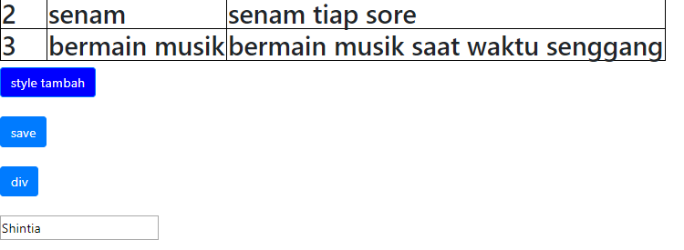
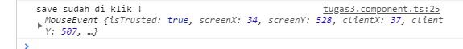
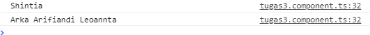

# Praktikum 4
## 3 | Displaying Data and Binding Data

### Bagian 1 : Component Basic
- ketik perintah yang ada dibawah ini pada course.component.ts
```
binding = 'property-binding';
imageUrl = 'http://lorempixel.com/400/200';
```

- dan tambahkan juga pada course.component.html
```
<h2>{{binding}} </h2>
```

### Bagian 2 : Kind Of Binding
- ketik code pada course.component.html

```

<button type="button" class="btn btn-primary" [style.backgroundColor]="isActive?'blue':'red'"> style tambah</button>
<br>
<button type="button" class="btn btn-primary" (click)="onSave($event)"> save </button>
<br>
<div (click)="onDivClick($event)">
  <button type="button" class="btn btn-primary" (click)="onSave($event)"> div </button>
</div>
<br>
<input type="text" [value]="nama" (keyup.enter)="nama=$event.target.value;onKeyup()">

```

- dan ketik juga di course.component.ts
```
  onSave($event){
    $event.stopPropagation();
    console.log("save sudah di klik !", $event);
  }
  onDivClick($event){
    console.log("div sudah di klik !", $event);
  }

  onKeyup(nama){
    console.log(this.nama);
  }
```
- maka hasilnya seperti ini :

    

- jika di klik button save maka :

    

- jika kita inputkan sesuatu pada field maka akan muncul seperti dibawah ini :

    


